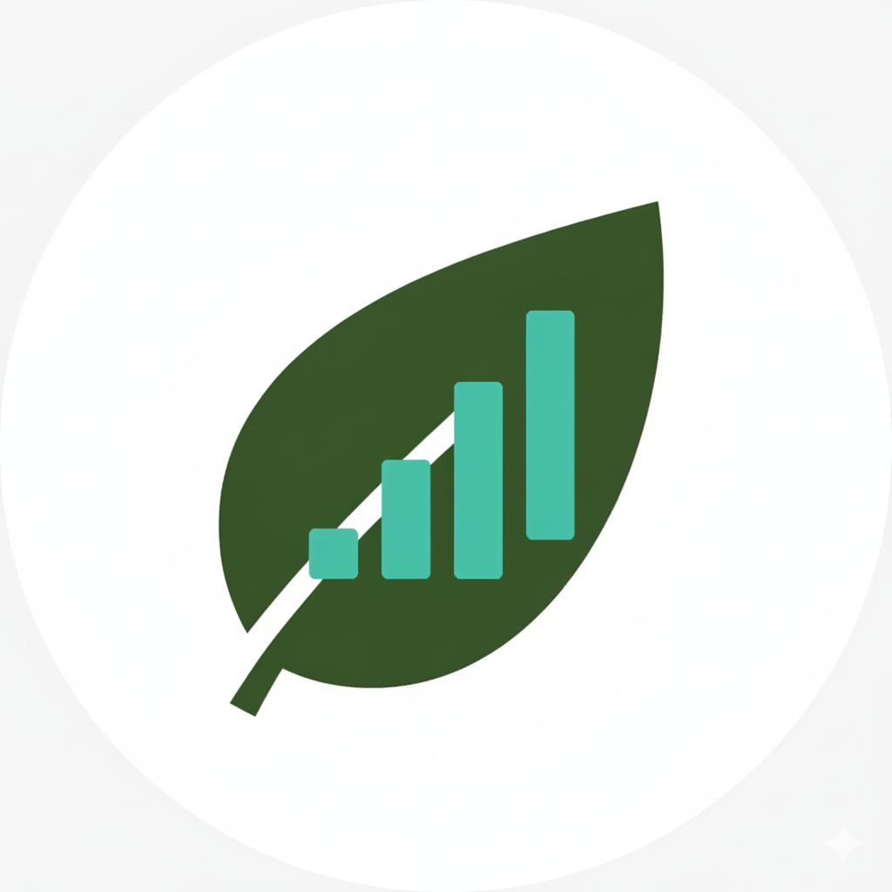

# EcoSteps - Hábitos Sustentáveis

 

EcoSteps é um aplicativo Flutter desenvolvido para ajudar usuários a desenvolver e monitorar hábitos sustentáveis. Com foco em metas de redução de lixo, uso de água e energia, o app oferece um onboarding intuitivo, consentimento de privacidade em conformidade com a LGPD, e uma experiência transparente e acessível.

## Funcionalidades Principais
- **Onboarding Interativo**: Três telas com ícones distintos (sustentabilidade, progresso e privacidade) para introduzir o usuário ao app.
- **Consentimento de Privacidade**: Leitura obrigatória de políticas e termos em Markdown, com barra de progresso e aceite opt-in.
- **Home Personalizada**: Card de boas-vindas para criar a primeira meta sustentável.
- **Revogação de Consentimento**: Opção em configurações com confirmação e possibilidade de "Desfazer".
- **Acessibilidade (A11Y)**: Suporte a text scaling, alto contraste WCAG AA, alvos de toque ≥48dp e foco visível.
- **Privacidade LGPD**: Transparência total, dados armazenados localmente, sem coleta automática de informações sensíveis.

## Pré-requisitos
- **Flutter**: Versão 3.0 ou superior. [Instale aqui](https://flutter.dev/docs/get-started/install).
- **Dart**: Incluído com Flutter.
- **VS Code**: Recomendado, com extensões Flutter e Dart instaladas.
- **Dispositivo/Emulador**: Android/iOS ou desktop (Windows/Mac/Linux) para testes.

## Instalação
1. Clone o repositório:
   ```bash
   git clone https://github.com/seu-usuario/ecosteps.git
   cd ecosteps
2. Instale as dependências:
- flutter pub get

3. Gere o ícone do app (opcional, mas recomendado):
flutter pub run flutter_launcher_icons:main

4. Adicione os arquivos de assets:
- Crie a pasta assets/policies/ e adicione privacy.md e terms.md (conteúdo em Markdown, conforme exemplos no código).
- Adicione assets/icon/icon.png (gere com base no prompt do PRD: ícone circular com folha e barras de progresso).

5. Como Executar
- Conecte um dispositivo ou inicie um emulador.
- Execute o app:
- 
flutter run

3. Para builds específicos:
- Android: flutter build apk
- iOS: flutter build ios
- Web/Desktop: flutter run -d chrome ou flutter run -d windows
- 
## Estrutura do Projeto:
lib/
├── main.dart                 # Ponto de entrada do app
├── theme/
│   └── app_theme.dart        # Definição de cores e temas (Material 3)
├── services/
│   └── prefs_service.dart    # Gerenciamento de preferências e consentimento
├── screens/
│   ├── splash_screen.dart    # Tela de splash com decisão de rota
│   ├── onboarding_screen.dart # Onboarding com 3 telas
│   ├── policy_viewer_screen.dart # Visualizador de políticas
│   └── home_screen.dart      # Tela inicial com card de metas
└── widgets/
    ├── onboarding_page.dart  # Widget reutilizável para páginas de onboarding
    └── dots_indicator.dart   # Indicador de progresso com dots
assets/
├── policies/
│   ├── privacy.md            # Política de privacidade (Markdown)
│   └── terms.md              # Termos de uso (Markdown)
├── icon/
│   └── icon.png              # Ícone do app (1024x1024, PNG)
└── images/                   # (Opcional) Para ilustrações adicionais
pubspec.yaml                  # Dependências e configuração

## Tecnologias Utilizadas
- Flutter: Framework para desenvolvimento cross-platform.
- Dart: Linguagem de programação.
- shared_preferences: Para armazenamento local de dados (consentimento, flags).
- flutter_markdown: Para renderizar políticas em Markdown.
- flutter_launcher_icons: Para gerar ícones do app automaticamente.
- 
## Testes e QA
- Siga o protocolo de QA do PRD:

- Execução Limpa: Onboarding → Políticas → Aceite → Home.
- Leitura Parcial: Verifique se o checkbox só habilita após leitura completa.
- Revogação: Teste com e sem "Desfazer" no SnackBar.
- A11Y: Ative text scaling e verifique acessibilidade.
- Execute testes unitários: flutter test.
  
## Contribuição
Contribuições são bem-vindas! Para contribuir:

- Fork o repositório.
- Crie uma branch para sua feature: git checkout -b feature/nova-funcionalidade.
- Commit suas mudanças: git commit -m 'Adiciona nova funcionalidade'.
- Push e abra um Pull Request.
- Licença
- Este projeto está sob a licença MIT. Veja o arquivo LICENSE para detalhes.
